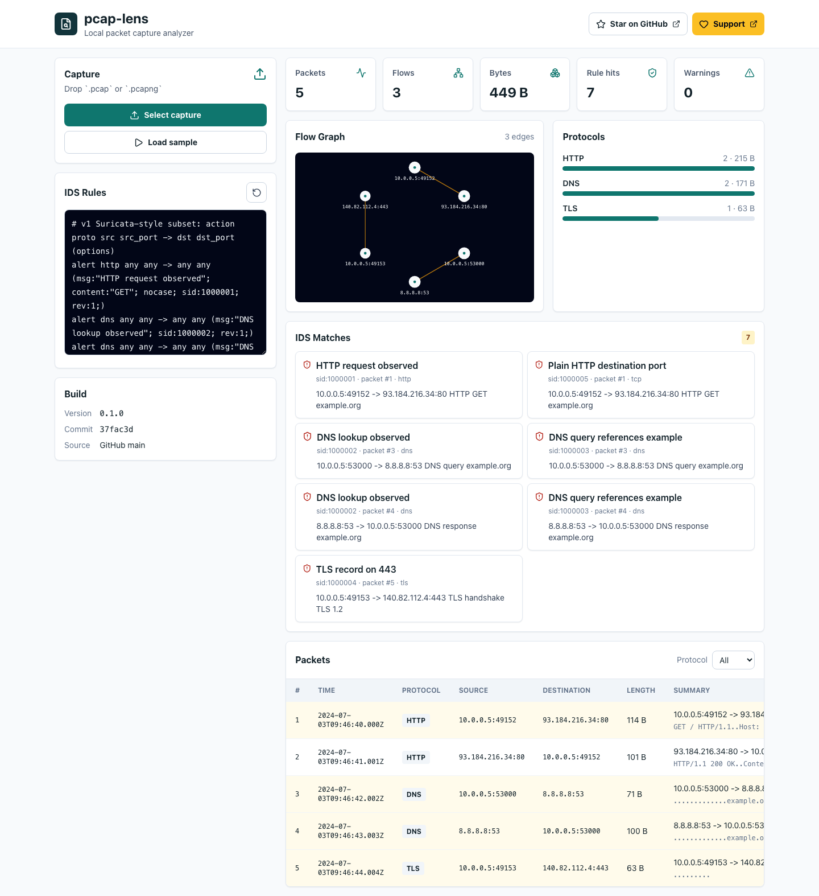
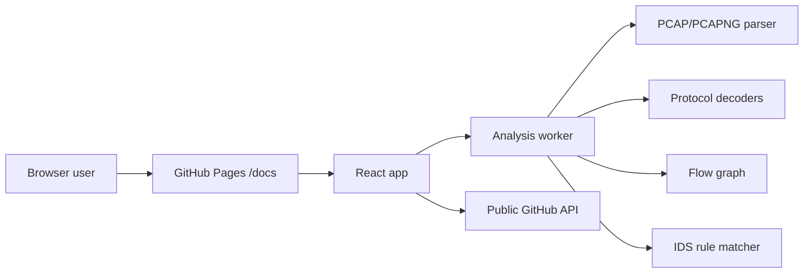

# pcap-lens


Live app:

https://baditaflorin.github.io/pcap-lens/

Repository: https://github.com/baditaflorin/pcap-lens

Support: https://www.paypal.com/paypalme/florinbadita

Browser-based PCAP analyzer with protocol decoding, flow graphs, and Suricata-style rule matching.

`pcap-lens` is a pure GitHub Pages app for local packet-capture triage. Drop a `.pcap` or `.pcapng` file into the browser to decode common protocols, build conversations, and run a documented subset of Suricata-compatible IDS rules without installing Wireshark or running a Suricata container. Captures stay in browser memory and are not uploaded by the app.



## Features

- Classic PCAP and PCAPNG parsing in the browser.
- Ethernet, Linux cooked capture v1, raw IPv4/IPv6 link handling.
- IPv4, IPv6, TCP, UDP, ICMP, DNS, HTTP, TLS metadata, and ARP decode.
- Flow aggregation with endpoint graph rendering.
- Suricata-style v1 rule subset: action, protocol, addresses, ports, direction, `msg`, `sid`, `rev`, `classtype`, `content`, and `nocase`.
- Build metadata panel showing version and the latest public `main` commit from GitHub.
- Direct links to https://github.com/baditaflorin/pcap-lens and https://www.paypal.com/paypalme/florinbadita in the live page.

## Quickstart

```sh
npm install
make install-hooks
make dev
make test
make build
```

## Local Checks

```sh
make lint
make test
make smoke
```

`make smoke` builds the app into `docs/`, serves it locally with the GitHub Pages base path, and runs the Playwright sample-capture happy path.

## Architecture



## Documentation

Architecture: https://github.com/baditaflorin/pcap-lens/blob/main/docs/architecture.md

ADRs: https://github.com/baditaflorin/pcap-lens/tree/main/docs/adr

Deploy guide: https://github.com/baditaflorin/pcap-lens/blob/main/docs/deploy.md

Privacy: https://github.com/baditaflorin/pcap-lens/blob/main/docs/privacy.md
