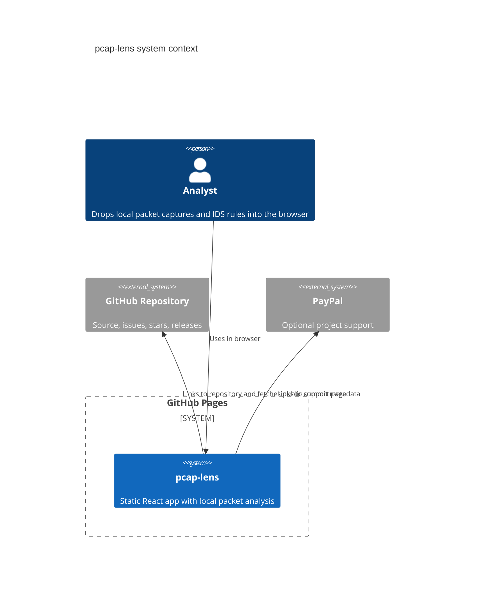
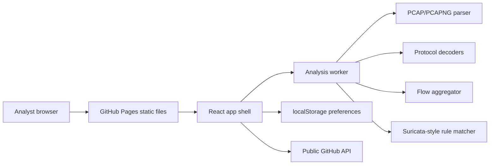

# Architecture

`pcap-lens` is a Mode A GitHub Pages application. Captures are parsed locally in the browser and are not uploaded.

Live app:

https://baditaflorin.github.io/pcap-lens/

Repository:

https://github.com/baditaflorin/pcap-lens

## Context

## Container

## Module Boundaries

- `features/capture`: capture file parsing and packet frame normalization.
- `features/protocols`: packet protocol decoders.
- `features/flows`: flow aggregation and graph construction.
- `features/rules`: Suricata-style rule parsing and matching.
- `features/analyzer`: orchestration and result shaping.
- `workers`: browser worker contract.
- `lib`: metadata, formatting, local storage, and shared errors.

## Pages Boundary

Everything served to users is static content from `/docs`. There is no runtime API, server database, Docker backend, nginx proxy, or secret-bearing process in v1.
